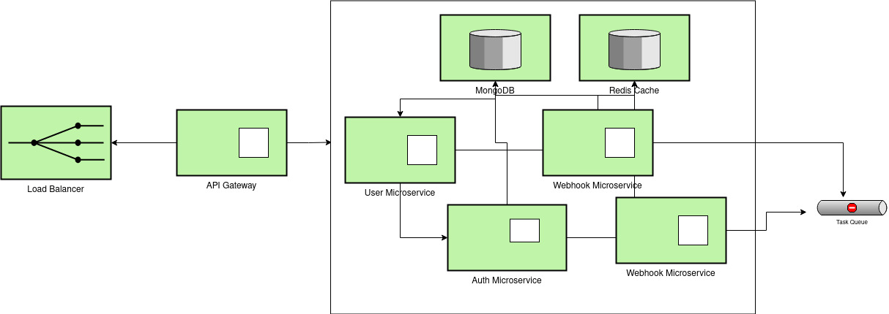

<p align="center">
		
		<h2 align="center"> Tyche </h2>
		<h4 align="center"> Yet another webhook handler. Built to scale! <h4>
</p>

## :triangular_flag_on_post: Features
- Microservice architecture using moleculer framework
- Docker files to running in Docker containers
- MongoDB database with [moleculer-db](https://github.com/moleculerjs/moleculer-db) and [moleculer-db-adapter-mongoose](https://github.com/moleculerjs/moleculer-db/tree/master/packages/moleculer-db-adapter-mongoose) modules
- NATS transporter
- Redis cacher
- RabbitMQ task queue
- [Traefik](https://traefik.io/) reverse proxy (in micro arch)
- Task queue based retry mechanism for webhook failures

## :nut_and_bolt: Install
```bash
git clone https://github.com/feniljain/tyche.git
cd tyche
npm install
npm start
```

## Architecture

<p align="center">
		
</p>

## :wrench: Development locally
_Running MongoDB, Redis and RabbitMQ is required on localhost!_

```bash
npm run dev
```

## :cloud: Start in Docker

### :office: Running as microservices
_All services are running in separated containers, communicate via NATS & use Traefik reverse proxy._
```bash
docker-compose up -d --build
```

You can scale up the containers
```bash
# Scale up the users service to 2 instances
docker-compose up -d --scale users=2
```

You can scale up the WWW service as well. Traefik is load balancing the requests to instances.
```bash
# Scale up the WWW service to 2 instances
docker-compose up -d --scale www=2
```

# License
This repo is available under the [MIT license](https://tldrlegal.com/license/mit-license).
